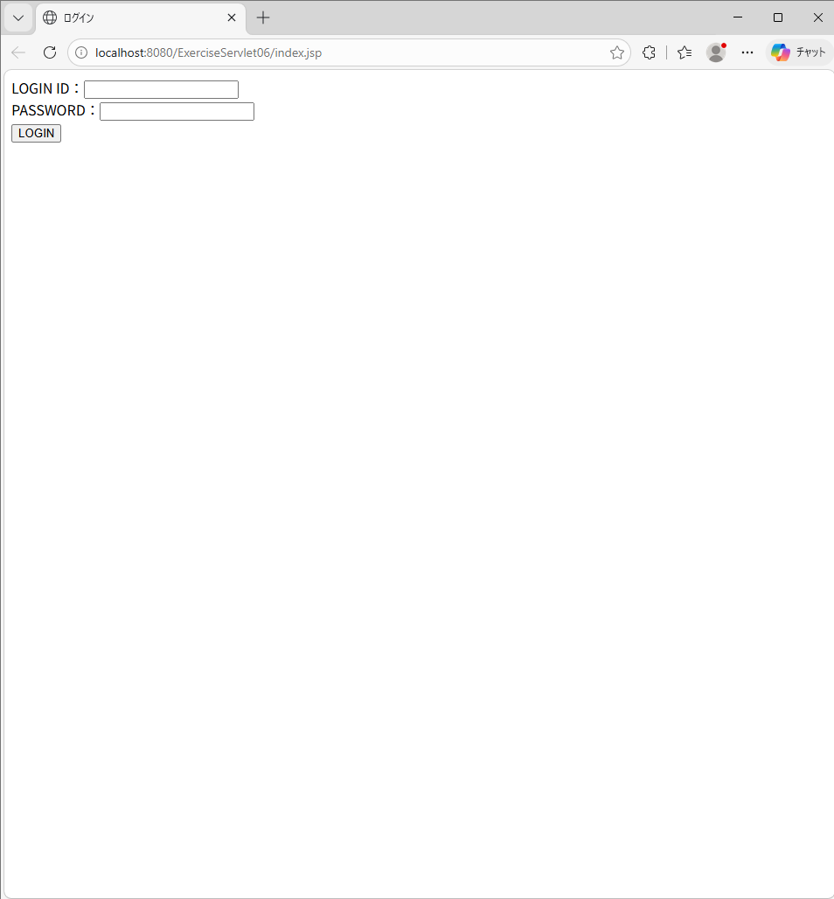
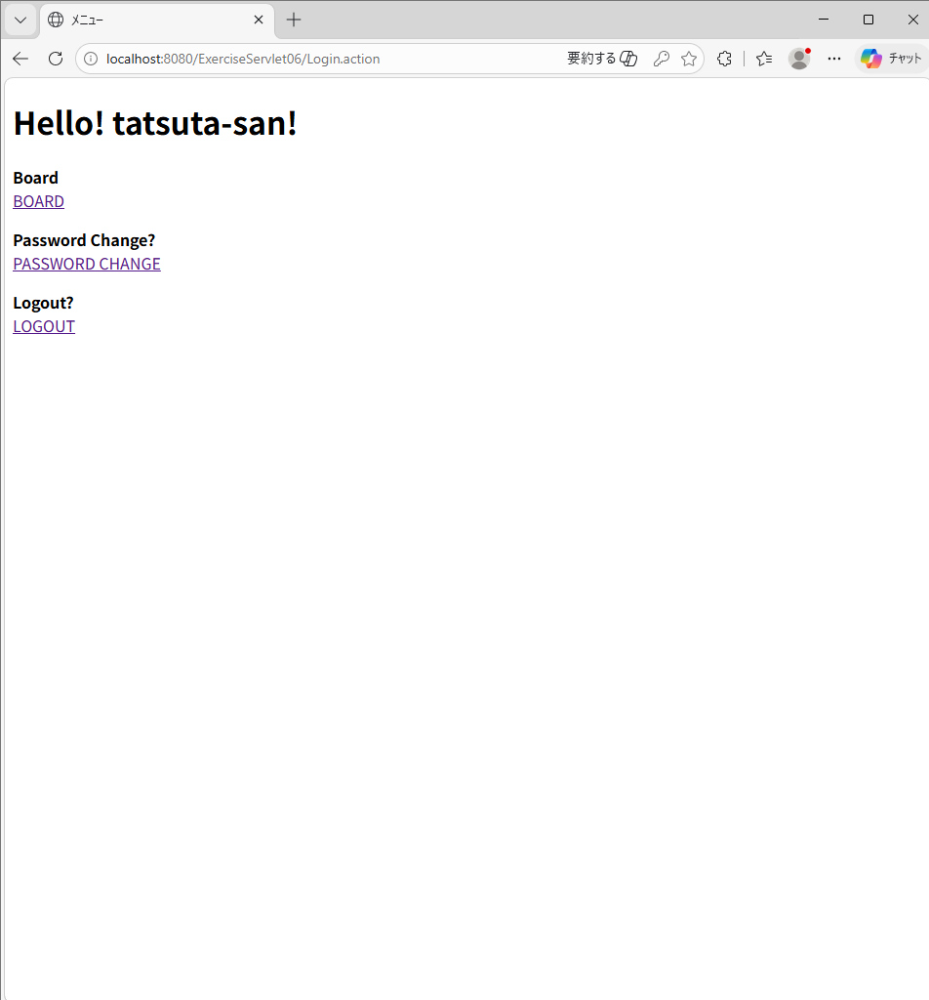
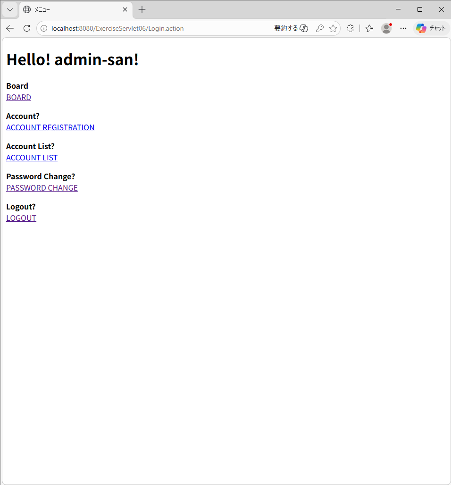
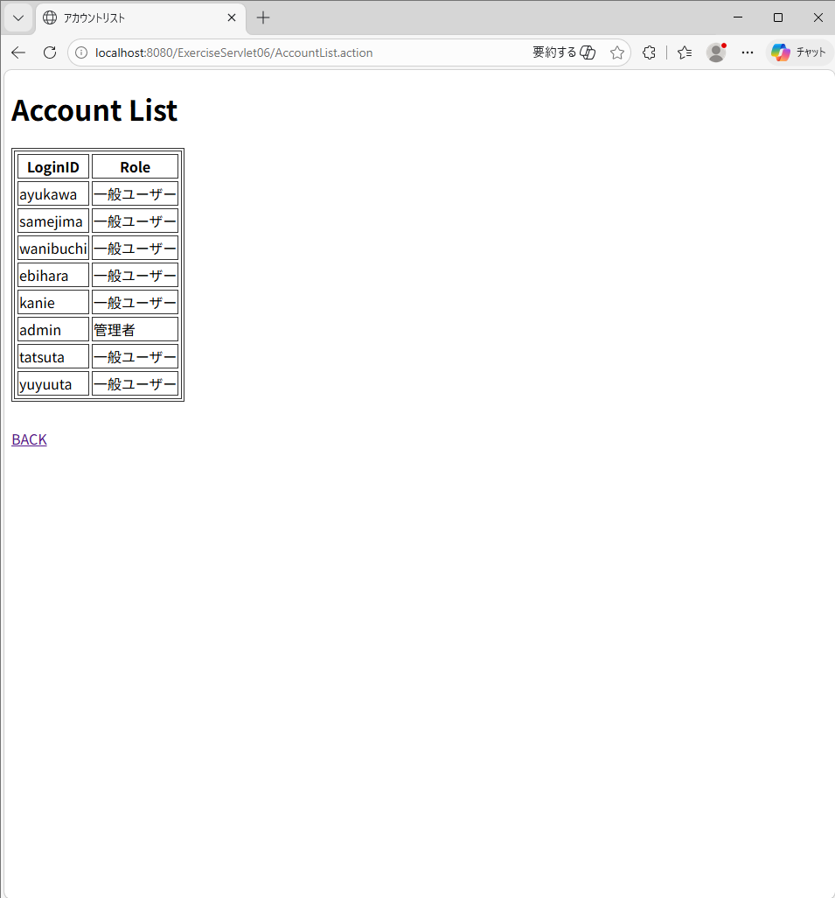
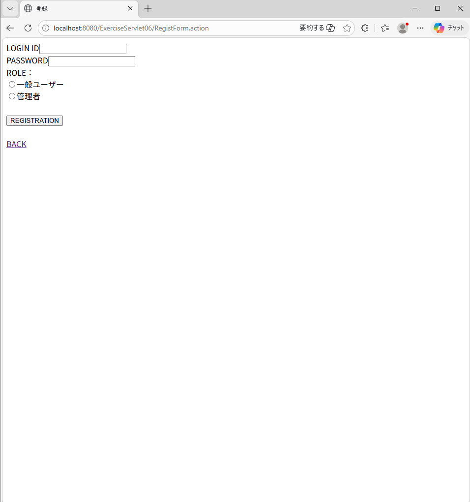
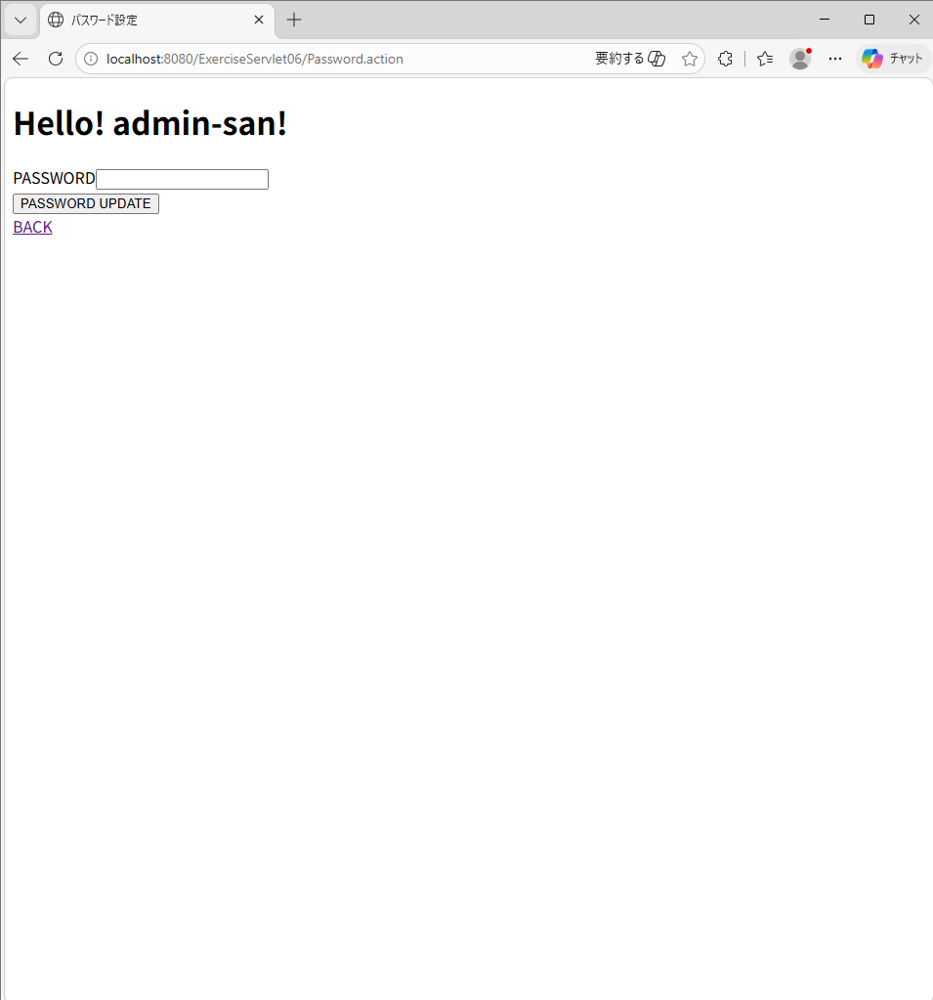

# つぶやき投稿＆ユーザー管理システム (Tsubuyaki App Pro)

Java Servlet と JSP を使用した、権限管理機能付きの掲示板アプリケーションです。
MVCモデルに基づいた設計を行っており、「一般ユーザー」と「管理者」で利用できる機能を動的に切り替えるロールベースのアクセス制御を実装しています。

---

## 📸 スクリーンショット

### 1. 認証・メニュー画面
| ログイン画面 | 一般ユーザー用メニュー | 管理者用メニュー |
| :---: | :---: | :---: |
|  |  |  |
| セッション管理による認証 | 掲示板・個人設定へ | アカウント管理メニューを表示 |

### 2. 掲示板機能（投稿・評価・ソート）
.png)
* **主な機能**: 投稿、削除（Clear）、いいね/よくないね機能。
* **ソート機能**: Date（日付）、Likes（いいね）、DisLikes（よくないね）の各項目で昇順・降順の並び替えが可能です。

### 3. 管理者限定・アカウント管理
| アカウントリスト | ユーザー新規登録 | パスワード再設定 |
| :---: | :---: | :---: |
|  |  |  |
| 全ユーザーの権限を一覧表示 | ID・PW・ロールを指定して登録 | 自身のパスワード変更機能 |

---

## 🚀 主な機能
- **権限別アクセス制御 (RBAC)**
  - **一般ユーザー**: 掲示板の利用（投稿・評価）、自身のパスワード変更。
  - **管理者**: 上記に加え、ユーザーの新規登録・アカウント一覧の参照。
- **インタラクティブな掲示板**
  - **評価機能**: 「いいね」「よくないね」のカウントアップ機能。
  - **動的ソート**: 投稿日時や評価数に基づいた一覧の並び替え。
- **セキュリティ・堅牢性**
  - **セッション管理**: ログイン状態を保持し、未ログイン時の不正アクセスを防止。

## 🛠 使用技術
- **言語**: Java 21
- **サーバーサイド**: Java Servlet / JSP (Jakarta EE)
- **フロントエンド**: HTML5 / CSS3 / JSTL
- **データベース**: MySQL / H2 Database (JDBC接続)
- **サーバー**: Apache Tomcat 10.1

---

## 🏗 システム構成 (MVCモデル)
本プロジェクトは、保守性を高めるために役割を以下のパッケージに分離して設計しています。

- **Model (`bean`, `dao`, `action`)**
  - `bean`: データのカプセル化（User, Board等）
  - `dao`: データベースへのCRUD操作。
  - `action`: ビジネスロジック（ログイン判定、投稿処理等）の実行。
- **View (`webapp/WEB-INF/view`)**
  - JSPによるユーザーインターフェース。
- **Controller (`servlet`)**
  - リクエストを受け付け、適切なActionへ振り分け。

---

## 💻 セットアップ・実行方法

### 1. プロジェクトのインポート
- **Eclipse**を起動します。
- **[ファイル]** > **[インポート]** > **[既存のプロジェクトをワークスペースへ]** を選択し、本リポジトリのフォルダを指定してください。

### 2. サーバーの構成
- **Apache Tomcat 10** をプロジェクトに紐付けます。
- プロジェクトを右クリック > **[実行]** > **[サーバーで実行]** を選択し、デプロイを行ってください。

### 3. 実行URL
ブラウザを立ち上げ、以下のURLにアクセスしてください。
- **URL**: `http://localhost:8080/ExerciseServlet06/`

---

## 👤 作成者
- GitHub: [MasahiroTatsuta](https://github.com/MasahiroTatsuta)
